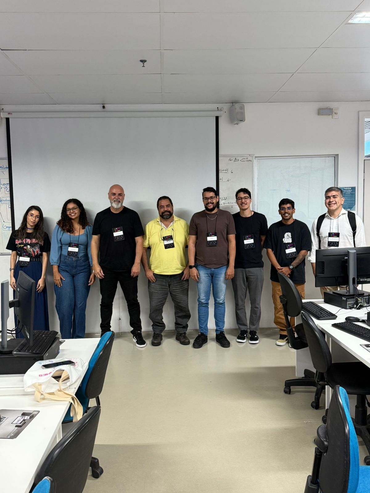

# ContatoQui
Aplicação de networking para o evento SBGAMES 2025. Permite que participantes se conheçam através da leitura de QR codes que contêm URLs do LinkedIn.

## Funcionalidades

- Leitura de QR codes via câmera
- Busca de perfis de participantes por URL do LinkedIn
- Visualização de perfis com informações profissionais
- Barras de progresso para mostrar níveis de proficiência
- Interface temática gamer com elementos visuais modernos

## Tecnologias

**Backend:**
- Django 4.2.7
- Django REST Framework
- SQLite (desenvolvimento)

**Frontend:**
- React 18
- Vite
- QR Scanner
- CSS moderno com tema gamer

## Como rodar

### Backend (Django)

1. Ative o ambiente virtual:
```bash
source venv/bin/activate
```

2. Instale as dependências:
```bash
pip install -r requirements.txt
```

3. Execute as migrações:
```bash
cd backend
python manage.py migrate
```

4. Carregue dados de exemplo:
```bash
python manage.py load_sample_data
```

5. Inicie o servidor:
```bash
python manage.py runserver
```

O backend estará disponível em `http://localhost:8000`

### Frontend (React)

1. Instale as dependências:
```bash
cd frontend
npm install
```

2. Inicie o servidor de desenvolvimento:
```bash
npm run dev
```

O frontend estará disponível em `http://localhost:5173`

## Uso

1. Abra o frontend no navegador
2. Clique em "Start Scanning" para ativar a câmera
3. Aponte para um QR code que contenha uma URL do LinkedIn
4. O perfil do participante será exibido automaticamente

## Dados de Exemplo

O sistema vem com 3 participantes de exemplo:
- Ana Silva (Unity/C#)
- Carlos Santos (Unreal/Python) 
- Maria Oliveira (React/JavaScript)

URLs para teste:
- `https://linkedin.com/in/ana-silva-gamedev`
- `https://linkedin.com/in/carlos-santos-artist`
- `https://linkedin.com/in/maria-oliveira-research`

## Admin

Acesse o admin Django em `http://localhost:8000/admin`
- Usuário: `admin`
- Senha: `admin123`

## Time



Este projeto foi desenvolvido com muito ❤️ durante um **AWS Vibe Coding Dojo** na **SBGAMES 2025**, onde desenvolvedores se reuniram para criar soluções inovadoras para a comunidade de jogos digitais.

## Estrutura do Projeto

```
cimatec-2025/
├── backend/                 # Django backend
│   ├── participants/        # App principal
│   ├── sbgames_backend/     # Configurações Django
│   └── manage.py
├── frontend/                # React frontend
│   ├── src/
│   │   ├── components/      # Componentes React
│   │   ├── services/        # API calls
│   │   └── styles/          # CSS
│   └── package.json
├── images/                  # Imagens do projeto
│   └── team.jpeg           # Foto do time
└── requirements.txt
```
